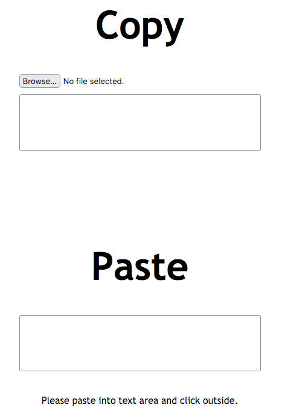

# File Copy And Paste

[](https://opensource.org/licenses/MIT)

**File Copy And Paste** is a simple HTML page that enables **copying files as base64 strings** and **pasting base64 strings into file downloads**.

Use it when a file needs to be transferred from one place to another and all you have is **clipboard sharing and web browsers** on both ends.

Tested in Chrome and Firefox. Written in vanilla Javascript. File sizes of 50+ MB possible.

## Usage
Download **FileCopyAndPaste.html** and open it in a web browser.

### Copy
Use the **Copy area** to open a file and copy the contents as a JSON-embedded base64 string. Format is:
```json
{
    "data": "<base64 data url>",
    "filename": "<filename>"
}
```

### Paste
Use the **Paste area** (possibly on a different machine) to paste the JSON string, click outside the textarea and download the file.

## Screenshot
